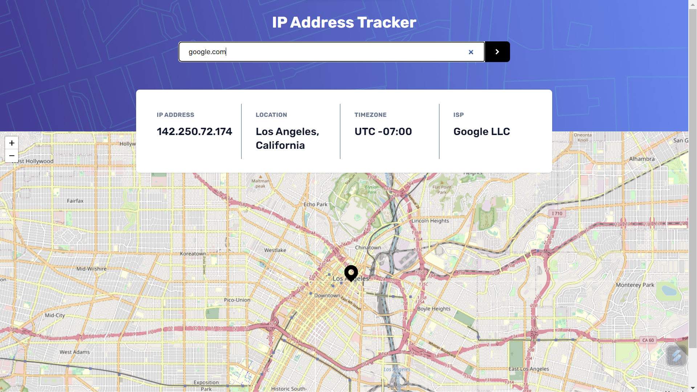
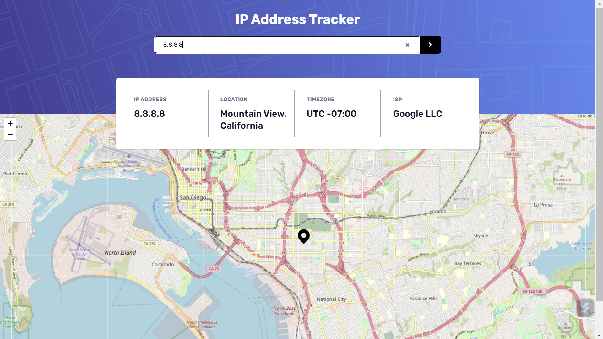

# Frontend Mentor - IP address tracker solution

This is a solution to the [IP address tracker challenge on Frontend Mentor](https://www.frontendmentor.io/challenges/ip-address-tracker-I8-0yYAH0). Frontend Mentor challenges help you improve your coding skills by building realistic projects. 

## Table of contents

  - [The challenge](#the-challenge)
  - [Screenshot](#screenshot)
  - [Links](#links)
  - [Built with](#built-with)
  - [What I learned](#what-i-learned)
  - [Useful resources](#useful-resources)
  - [Author](#author)

### The challenge

Users should be able to:

- View the optimal layout for each page depending on their device's screen size
- See hover states for all interactive elements on the page
- See their own IP address on the map on the initial page load
- Search for any IP addresses or domains and see the key information and location

### Screenshot

### Links

- Solution URL: [  URL](https://github.com/Psargar616/ip-address-tracker-using-react)
- Live Site URL: [ URL ](https://ip-address-tracker-react-fmsoln.netlify.app/)

### Built with

- Semantic HTML5 markup
- CSS custom properties
- Flexbox
- CSS Grid
- Mobile-first workflow
- [React](https://reactjs.org/) - JS library

### What I learned

- React hooks such as useState, useEffect, useMap, useMemo
- Using React leaflet for map

### Useful resources

- [React.dev](https://reactjs.org/) - helped in uunderstanding react hooks

## Author

- Frontend Mentor - [@Psargar616](https://www.frontendmentor.io/profile/Psargar616)
